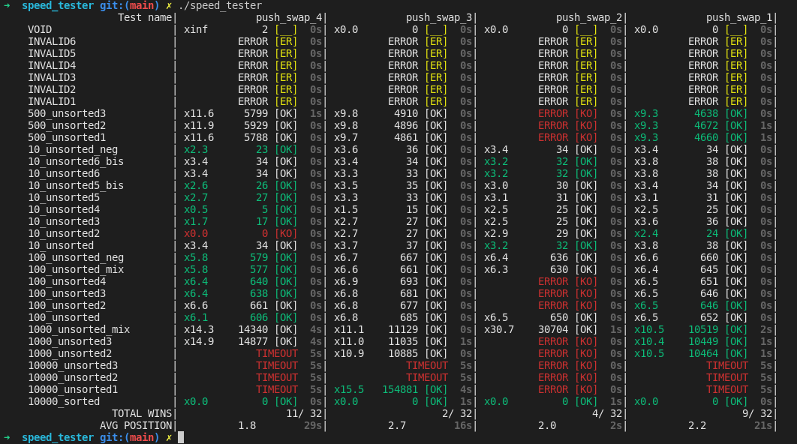

# Push_swap_speed_tester - 42Lisbon

To clone with submodules: `git clone --recursive <project url>`

A little program to test different push_swaps with custom stacks

## How to
- Compile the speed_tester with `make`
- Compile and move the push_swap binaries you want to test in `prog_to_test/`
- You'll find some precompiled push_swaps in `prog_to_test_linux` and `prog_to_test_mac`
- Add/remove/modify the tests in `tests/`
- You'll find also some example of tests in `tests_ALL`
- Run `./speed_tester`

## Mac OS instructions
- You'll need to install `brew` and then install the command with `brew install coreutils`
- Then select accordingly `TIMEOUT_CMD` in `headers/speed_tester.h`
- If you are on 42 Macs you can install Homebrew [here](https://github.com/kube/42homebrew)

## Linux instructions
- Just be sure the right value is attributed to `TIMEOUT_CMD` in `headers/speed_tester.h`

## If push_swaps doesn't work
- Be sure the access rights on the binary files are 777
- If it still doesn't work you'll find a commented line in `ft_run_tests.c`, you can comment it out and compile the see each program output directly

## Disclaimer
- Only my checker is used for the checks (and it may have bugs)
- If you want to use your checker, do `make` and then replace `checker` binary with your binary
- This program is mainly focused on comparing speeds, better not to rely too much on it for checking your arguments partising
- The program have a default timeout for each push_swap test, you can change it in `speed_tester.h`
- If you want to check very large input files you may want to increase `BUF_SIZE` and `OP_STR_SIZE` in `speed_tester.h`
